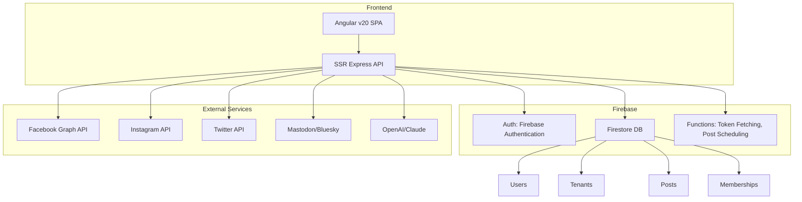

# 🧭 Post Vector Architecture and Plan

A collaborative, multi-tenant, web-based social media scheduler and publisher built with Angular v20, Firebase, and Express (SSR).

---

## 🚧 Current Stack

- **Frontend**: Angular v20 with SSR
- **Backend/API**: Angular SSR with Express
- **Auth & Storage**: Firebase Authentication + Firestore
- **Deployment**: Firebase Hosting with Functions

---

## 🗺️ Development Roadmap

### ✅ Phase 1: Core Facebook Integration (Complete)
- [x] Facebook OAuth & Page Token acquisition
- [x] Firestore token storage
- [x] API route to post to Facebook

---

### 🚀 Phase 2: User & Tenant Management
**Goal**: Enable multiple users and tenant-based collaboration
- [ ] Firebase Authentication (Email/Google OAuth)
- [ ] Firestore schema for `Users` and `Tenants`
- [ ] Invitation system for adding users to tenants
- [ ] Role-based access control (`admin`, `editor`, `viewer`)

**Firestore Structure**
```
/tenants/{tenantId}
/users/{userId}
/memberships/{userId}_{tenantId} => { role, joinedAt }
/posts/{postId} => { tenantId, platform, content, scheduledAt }
```

---

### 🌐 Phase 3: Multi-Network Support
**Goal**: Expand beyond Facebook
- [ ] Add integration modules for:
  - [ ] Instagram (Graph API)
  - [ ] Threads (TBD - Meta API)
  - [ ] Mastodon (OAuth2 + REST API)
  - [ ] Twitter/X (v2 API with elevated access)
  - [ ] Bluesky (ATProto client)
- [ ] Unified social post model
- [ ] Platform selector UI in post composer

---

### ⏱️ Phase 4: Scheduled Posting Engine
**Goal**: Queue posts for future publishing
- [ ] Cloud Function or App Engine scheduler
- [ ] Post queue per tenant
- [ ] Dashboard calendar view
- [ ] Retry logic & failure alerts

---

### 🤖 Phase 5: AI-Powered Post Generation
**Goal**: Help tenants generate on-brand content
- [ ] Integration with an LLM for:
  - [ ] Post suggestions based on keywords
  - [ ] Image suggestions and generation
  - [ ] Tone/style matching per tenant
- [ ] Prompt templates per industry
- [ ] Feedback loop for content improvement

---

## 🧩 Collaboration Guidelines

| Area           | Guideline                                                          |
| -------------- | ------------------------------------------------------------------ |
| **Codebase**   | Use Angular Standalone Components, strict types, modular structure |
| **Branching**  | Use `main`, `dev`, and feature branches (`feature/ai-integration`) |
| **Commits**    | Follow Conventional Commits (`feat:`, `fix:`, `chore:`)            |
| **PR Reviews** | All merges to `dev` or `main` must go through code review          |
| **Tasks**      | Use GitHub Issues + Project Boards per phase                       |
| **Docs**       | Document API endpoints using `README.md` in `/api` folder          |
| **Security**   | Tokens encrypted at rest, Role-based Firestore rules               |

---

## 🛠 Suggested Tools & Services

- **Scheduler**: Firebase Scheduled Functions / Google Cloud Scheduler
- **Auth & Tenanting**: Firebase Auth + Firestore custom roles
- **AI**: OpenAI GPT API or Claude 3 via proxy
- **Monitoring**: Sentry or Firebase Crashlytics
- **Testing**: Playwright (frontend) + Firebase Emulator Suite (backend)

---

## 🖼️ Architecture Diagram (Mermaid)


